  

# 🛡️ AI-Safe Jobs: Comprehensive Guide to Future-Proof Careers in the Age of Artificial Intelligence 🚀

  
  
  
  
  

👋 Welcome to **AI-Safe Jobs**, an open-source curated reference directory analyzing careers, professions, and asset-based roles that remain resilient against artificial intelligence (AI) 🤖, automation ⚡, and machine learning 🧠 advancements.

---

## 📌 Executive Summary & Key Takeaways 💡

As artificial intelligence rapidly transforms industries, white-collar administrative and computer-bound tasks face increasing risk of automation. However, jobs requiring **physical dexterity in unstructured environments** 🛠️, **legal/ethical liability** ⚖️, **authentic human empathy** ❤️, and **capital/real-property ownership** 🏢 demonstrate exceptionally strong AI safety profiles.

### 🌟 Primary Drivers of AI Invariance:
1. 🔧 **Physical & Spatial Dexterity:** Dexterous real-world labor in dynamic, unpredictable environments (e.g., plumbers, electricians).
2. 🚜 **Capital & Asset Ownership:** Roles tied to physical property, land, and capital allocation rather than labor execution (e.g., land lords, farm owners).
3. ⚖️ **Legal & Moral Accountability:** High-stakes decisions requiring human ethics, constitutional authority, or legal liability (e.g., judges, doctors).
4. 🎭 **Authentic Human Connection & Presence:** Experiences valued specifically because they are delivered by a living human being (e.g., live performers, athletes).

---

## 📊 Comprehensive AI-Safe Jobs Matrix 📈

Below is a detailed breakdown of careers, their primary categories, human-exclusive value propositions, estimated automation risk levels, and physical or capital dependencies.

| Job Title | Category | Primary Human Value / AI Limitation | Automation Risk Level | Capital/Physical Dependency |
| :--- | :--- | :--- | :--- | :--- |
| ⚖️ **Lawyer** | Legal | Complex courtroom argument, ethics, legal liability | Low-Medium | High (Credentials & Experience) |
| 🧑‍⚖️ **Judge** | Legal | Ultimate authority, moral judgement, legal empathy & ethics | Low | High (Constitutional Authority) |
| 🩺 **Doctor** | Medical / Healthcare | Physical intervention, bed-side empathy, clinical liability | Low | High (Licensure & Training) |
| 💖 **Sexworker** | Personal Services | Physical human touch, intimacy, emotional connection | Low | High (Physical Presence) |
| 🚜 **Farm Owner** *(not farmer)* | Agriculture / Asset Owner | Land ownership, capital allocation, real property asset | Very Low | Very High (Real Estate & Capital) |
| 🏠 **Land Lord** *(House Renter)* | Real Estate / Asset Owner | Property ownership, capital investment, real estate equity | Very Low | Very High (Property Capital) |
| 🚖 **Taxi Owner** *(not driver)* | Transportation / Fleet Owner | Asset capital, fleet management ownership | Very Low | Very High (Vehicle Assets) |
| 🏨 **Hotel Owner** | Hospitality / Asset Owner | Commercial real estate asset ownership, strategic capital | Very Low | Very High (Commercial Assets) |
| 🍽️ **Restaurant Owner** | Hospitality / Asset Owner | Business capital, concept ownership, local presence | Very Low | Very High (Capital & Operations) |
| 🎤 **Live Performers** | Entertainment & Arts | Live presence, charisma, organic human performance | Low | Medium (Talent & Stage Access) |
| 💃 **Strippers** | Personal Services & Entertainment | Physical presence, human interaction, live venue performance | Very Low | High (Physical Presence) |
| ⚡ **Electrician** | Skilled Trades | Complex physical dextral work in dynamic non-standard spaces | Very Low | Medium (Licensure & Hands-on Tools) |
| 🔧 **Plumber** | Skilled Trades | Dynamic environmental troubleshooting, physical plumbing work | Very Low | Medium (Licensure & Hands-on Tools) |
| 🔨 **Carpenter** | Skilled Trades | Precision physical fabrication in non-standard physical sites | Very Low | Medium (Hands-on Craft & Tools) |
| 🏛️ **Politician** | Governance / Public Service | Human governance, public trust, voting legitimacy, leadership | Very Low | High (Social & Political Capital) |
| ⚽ **Athletes & Sportsmen** | Sports & Physical Entertainment | Peak human physical performance & competitive spectacle | Very Low | High (Physical Capability) |
| 🤝 **Field Sales** *(not inside sales)* | Sales & Business Development | In-person relationship building, high-stakes human negotiation | Low | Medium (Travel & Interpersonal Skill) |
| ✈️ **Cabin Crew** *(esp. Air hostess)* | Aviation / Safety & Service | In-flight emergency handling, physical passenger safety & hospitality | Low | High (Physical Training & Presence) |
| ⛪ **Priest / Pastor** | Religion & Spirituality | Spiritual authority, faith leadership, human empathy & grief support | Very Low | High (Community & Faith Trust) |
| 🔮 **Psychic** | Personal Services / Entertainment | In-person intuition, personal human counseling & performance | Very Low | Low (Personal Connection) |
| 🧑‍🚒 **Firefighter** | Public Safety / Emergency Services | Dynamic emergency rescue, hazardous physical intervention, lives at risk | Very Low | High (Physical Fitness & Training) |
| 🥽 **Commercial Diver** | Marine / Infrastructure | Underwater repairs, extreme pressure environments, physical inspection | Very Low | High (Specialized Diving Gear & Risk) |
| 🥋 **Martial Arts Instructor** | Sports & Personal Coaching | Hands-on physical technique correction, sparring, personal mentorship | Very Low | Medium (Physical Expertise & Dojo) |
| 🧑‍🍳 **Executive Chef** *(Fine Dining)* | Culinary & Hospitality | Multi-sensorial taste creation, kitchen leadership, live culinary art. Having said that we have robotic chefs already | Low | Medium (Culinary Mastery & Kitchen) |
| 📐 **Land Surveyor** | Civil Engineering & Construction | Outdoor rugged terrain physical measurements, boundary legal certification | Very Low | High (Field Gear & Legal License) |
| 🧱 **Mason / Bricklayer** | Skilled Trades | Non-standard masonry, structural physical restoration, manual labor. Having said that we have brick laying robots already | Low | Medium (Physical Strength & Craft) |
| 💆 **Massage Therapist** | Wellness & Personal Care | Physical tactile feedback, bodywork manipulation, human comfort | Very Low | Medium (Physical Presence & Touch) |
| 🦮 **Dog Trainer / Animal Behaviorist** | Animal Care & Services | In-person animal body language reading, physical behavioral correction | Very Low | Medium (Hands-on Experience) |

---

## 🔍 Frequently Asked Questions (FAQ) ❓

### 🛡️ What makes a job "AI-Safe"?
An AI-safe job typically relies on capabilities that AI and robotics currently cannot replicate cost-effectively: dynamic physical manipulation in un-mapped environments, legal liability holding, moral/moral empathy, or legal asset ownership.

### 🛠️ Are trades (electricians, plumbers) really safe from AI?
Yes. While cognitive tasks like writing software or analyzing documents can be automated remotely using LLMs, trades require physical manipulation in complex, non-standardized environments. Robotic hardware remains decades behind the dexterity required for unpredictably retrofitting existing buildings.

### 🏢 Why are "Owners" distinguished from "Workers"?
Ownership (land, fleet, hotel, farm) is an economic function based on capital rights rather than task execution. AI may optimize management operations, but capital ownership yields returns to the asset holder.

---

## 🤝 Contributing & Community Support 🌐

Contributions are welcome! If you would like to suggest a new career path, refine an automation risk assessment, or add relevant market data:

1. 🍴 Fork this repository.
2. 🌿 Create a feature branch (`git checkout -b feature/add-job-role`).
3. 💾 Commit your changes (`git commit -m 'Add new AI-safe career profile'`).
4. 🚀 Push to the branch (`git push origin feature/add-job-role`).
5. 📬 Open a Pull Request.

---

## 🌟 Star History ⭐

---

## 📜 License 📄

Distributed under the MIT License. See `LICENSE` for more information.
